# 基于RAG的金融领域智能对话系统 - 技术架构设计文档

---

## 1. 项目概述

### 1.1 项目定位
本系统是一个基于 **Retrieval-Augmented Generation (RAG)** 技术的**金融领域智能对话系统**，支持多角色扮演、多模态输入（图片/语音/视频）、长期记忆和流式输出。

### 1.2 核心技术特性

| 特性 | 说明 |
|------|------|
| **多角色支持** | 11种内置角色（金融理财师、投资顾问、医生、律师等） |
| **RAG增强** | 混合检索（稠密向量+BM25稀疏向量）+ BGE-Reranker重排序 |
| **长期记忆** | Milvus向量数据库存储用户对话历史 |
| **短期记忆** | Redis缓存最近对话上下文 |
| **多模态输入** | 支持TXT/PDF/DOCX/图片OCR/语音ASR/视频帧提取OCR |
| **流式输出** | SSE流式响应，实时显示AI回答 |
| **多LLM支持** | DeepSeek/百度文心一言/阿里通义千问 |

---

## 2. 系统架构图

### 2.1 整体架构

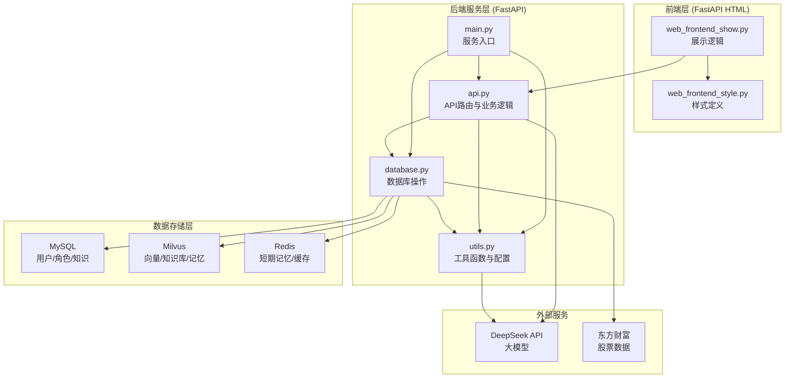

### 2.2 技术栈

| 层次 | 技术 | 版本 |
|------|------|------|
| 前端 | FastAPI + HTML/CSS/JS | 内嵌模板 |
| 后端 | FastAPI + Uvicorn | 0.104+ |
| 大模型 | DeepSeek API | v1 |
| 向量化 | BGE-m3 | 1.2+ |
| 重排序 | BGE-rerank | 1.2+ |
| 向量数据库 | Milvus | 2.6+ |
| 关系数据库 | MySQL | 5.7+ |
| 缓存 | Redis | 6.0+ |

---

## 3. 项目文件结构

```
project_root/
│
├── last_duan/                          # 【后端核心目录】
│   ├── __init__.py                     # 包初始化
│   ├── main.py                         # ⭐ 入口文件：服务初始化与启动
│   ├── api.py                          # ⭐ API路由：所有接口定义与业务逻辑
│   ├── database.py                     # ⭐ 数据库层：MySQL/Milvus/Redis操作
│   ├── utils.py                        # ⭐ 工具层：配置/模型/工具函数
│   └── rag_system.log                  # 日志文件
│
├── web_frontend/                       # 【前端目录】
│   ├── web_frontend_show.py            # ⭐ 前端展示逻辑：HTML/JS
│   └── web_frontend_style.py           # ⭐ 前端样式：CSS/主题配置
│
├── peizhi_huanjing/                    # 【配置目录】
│   ├── .env                            # 环境变量配置
│   └── requirements.txt                # 依赖列表
│
├── data/                               # 【数据目录】
│   ├── financial_advisor_qa.csv        # 金融知识数据
│   ├── eastmoney_stock_list.json       # 股票列表缓存
│   └── ...
│
├── jiagou/                             # 【架构文档目录】
│   └── 技术架构设计文档.md              # 本文档
│
└── reload_knowledge.py                 # 知识库加载脚本
```

---

## 4. 核心模块详解

### 4.1 main.py - 服务入口模块

**职责**：服务初始化、应用创建、启动Uvicorn

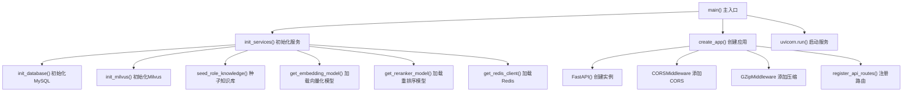

**核心函数**：

| 函数名 | 功能 | 输出 |
|--------|------|------|
| `main()` | 主入口，协调初始化和启动 | 启动Uvicorn服务 |
| `init_services()` | 初始化所有依赖服务 | 初始化MySQL/Milvus/Redis/模型 |
| `create_app()` | 创建FastAPI应用实例 | FastAPI实例 |

---

### 4.2 api.py - API路由与业务逻辑模块

**职责**：所有路由接口、请求处理、业务逻辑

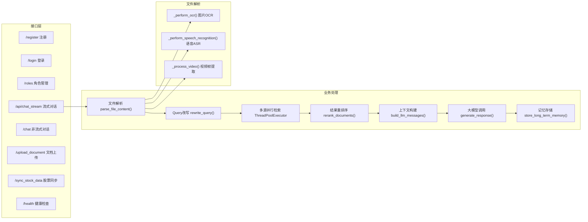

**核心接口**：

| 接口 | 方法 | 功能 |
|------|------|------|
| `/register` | POST | 用户注册 |
| `/login` | POST | 用户登录 |
| `/roles` | GET | 获取角色列表 |
| `/api/chat_stream` | POST | ⭐流式对话（核心） |
| `/chat` | POST | 非流式对话 |
| `/upload_document` | POST | 上传知识文档 |
| `/sync_stock_data` | POST | 同步股票数据 |
| `/health` | GET | 健康检查 |

**核心函数**：

| 函数名 | 功能 |
|--------|------|
| `register_api_routes()` | 注册所有API路由 |
| `build_llm_messages()` | 构建发送给LLM的消息列表 |
| `generate_response()` | 生成大模型回答（流式/非流式） |
| `parse_file_content()` | 解析上传文件（支持多种格式） |
| `_perform_ocr()` | 图片OCR识别 |
| `_perform_speech_recognition()` | 语音识别 |
| `_process_video()` | 视频帧提取+OCR |

---

### 4.3 database.py - 数据库操作模块

**职责**：MySQL/Milvus/Redis的所有数据库操作

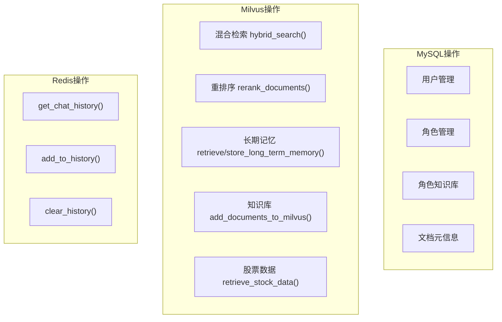

**核心函数**：

| 函数名 | 功能 | 存储 |
|--------|------|------|
| `init_database()` | 初始化MySQL表结构 | MySQL |
| `register_user()` | 用户注册 | MySQL |
| `login_user()` | 用户登录 | MySQL |
| `get_roles()` | 获取角色列表 | MySQL |
| `get_role_prompt()` | 获取角色提示词 | MySQL |
| `hybrid_search()` | ⭐混合检索（稠密+稀疏向量） | Milvus |
| `rerank_documents()` | BGE-Reranker重排序 | - |
| `retrieve_long_term_memory()` | 检索长期记忆 | Milvus |
| `store_long_term_memory()` | 存储长期记忆 | Milvus |
| `add_documents_to_milvus()` | 添加文档到知识库 | Milvus |
| `retrieve_stock_data()` | 检索股票数据 | Milvus |
| `get_chat_history()` | 获取聊天历史 | Redis |
| `add_to_history()` | 添加到聊天历史 | Redis |

---

### 4.4 utils.py - 工具函数与配置模块

**职责**：配置常量、模型管理、工具函数

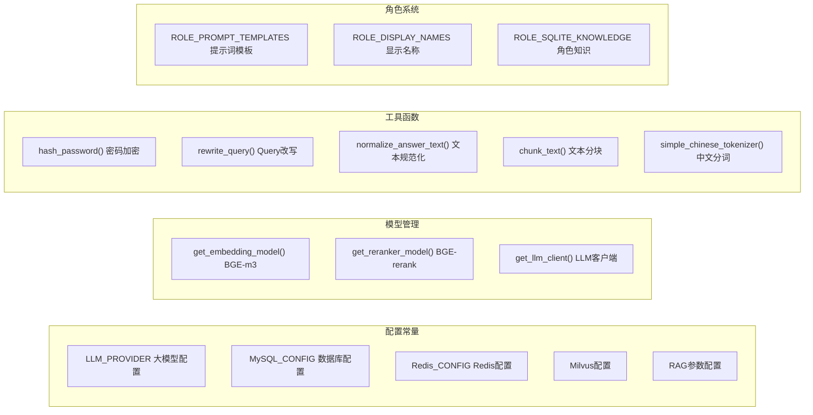

**核心配置**：

| 配置项 | 说明 | 默认值 |
|--------|------|--------|
| `LLM_PROVIDER` | 大模型提供商 | deepseek |
| `EMBEDDING_DIM` | 向量维度 | 1024 |
| `CHUNK_SIZE` | 文本分块大小 | 512 |
| `TOP_K_RETRIEVE` | 检索Top-K | 5 |
| `TOP_K_RERANK` | 重排序Top-K | 2 |
| `MEMORY_LENGTH` | 记忆长度 | 3 |

**核心函数**：

| 函数名 | 功能 |
|--------|------|
| `get_embedding_model()` | 获取BGE-m3向量化模型 |
| `get_reranker_model()` | 获取BGE-reranker重排序模型 |
| `get_llm_client()` | 获取LLM客户端（支持多提供商） |
| `rewrite_query()` | 基于历史改写用户Query |
| `normalize_answer_text()` | 规范化回答文本 |
| `hash_password()` | 密码哈希加密 |

---

### 4.5 web_frontend_show.py - 前端展示逻辑模块

**职责**：提供登录/注册/角色选择/聊天的Web界面

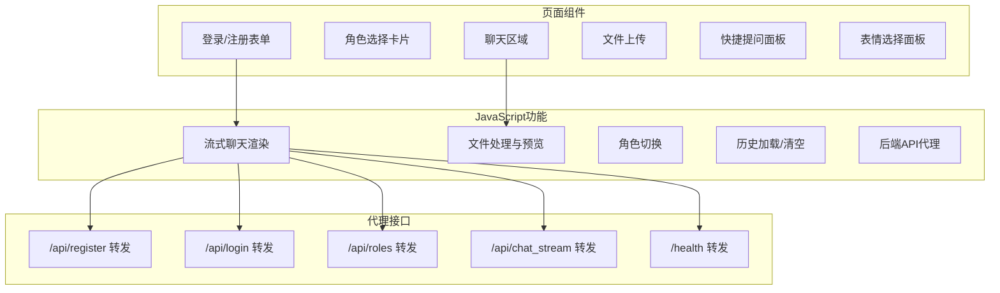

**核心功能**：

| 功能 | 说明 |
|------|------|
| 登录/注册 | 用户认证界面 |
| 角色选择 | 11种角色卡片展示 |
| 流式聊天 | SSE实时显示AI回答 |
| 文件上传 | 支持图片/语音/视频 |
| 快捷提问 | 预设问题快速提问 |
| 表情选择 | Emoji表情插入 |
| API代理 | 解决浏览器跨域问题 |

---

### 4.6 web_frontend_style.py - 前端样式模块

**职责**：CSS样式定义、主题配置

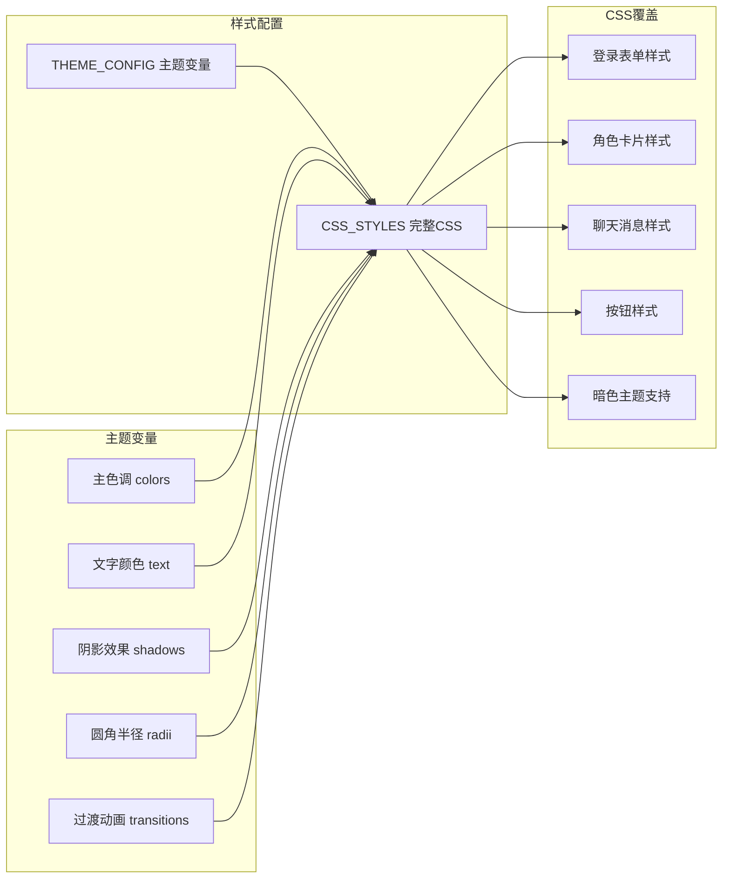

---

## 5. 系统执行流程

### 5.1 服务启动流程

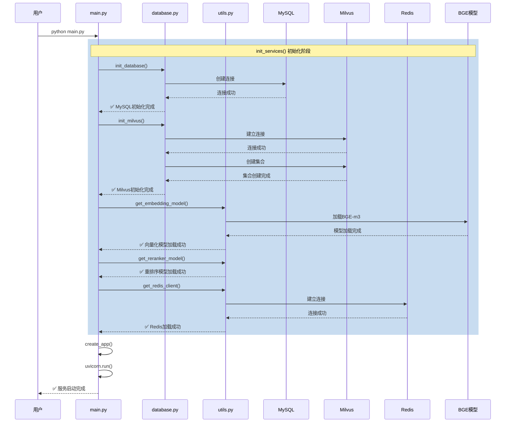

### 5.2 对话请求流程（核心RAG流程）

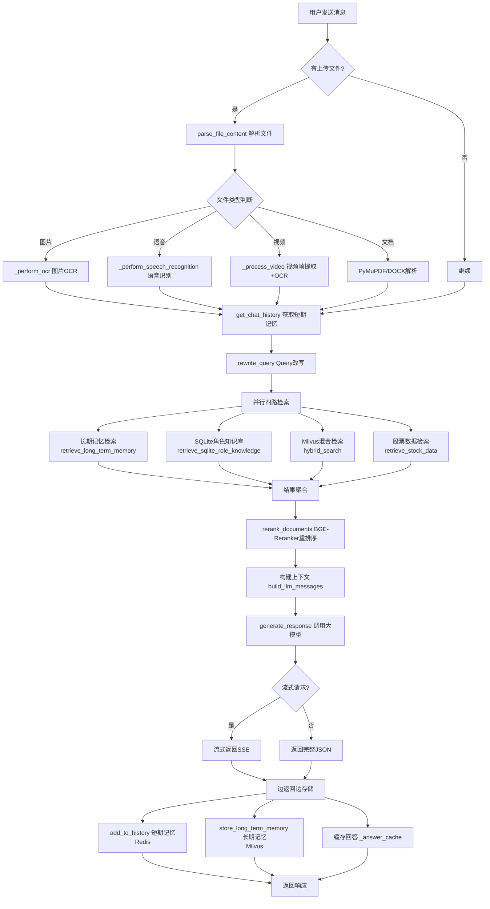

### 5.3 文件解析流程

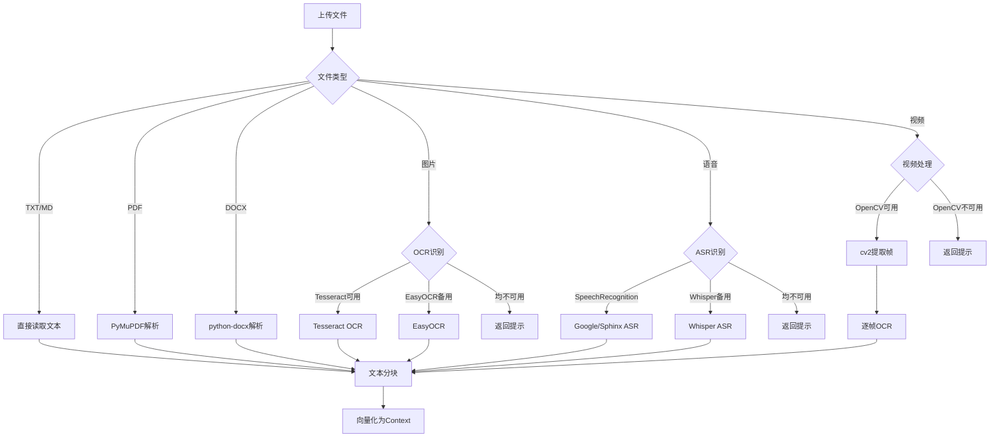

---

## 6. 数据流与存储

### 6.1 数据库架构

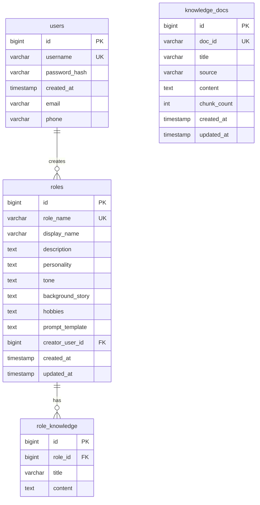

### 6.2 Milvus集合设计

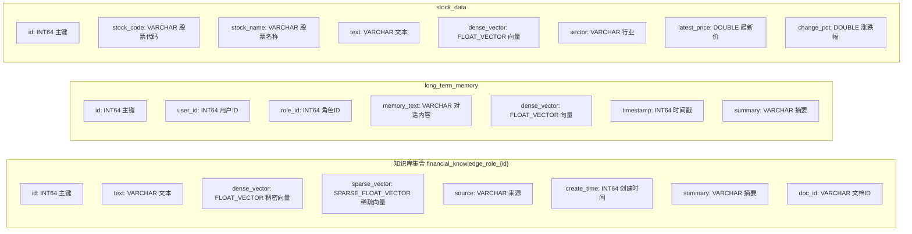

### 6.3 Redis数据结构

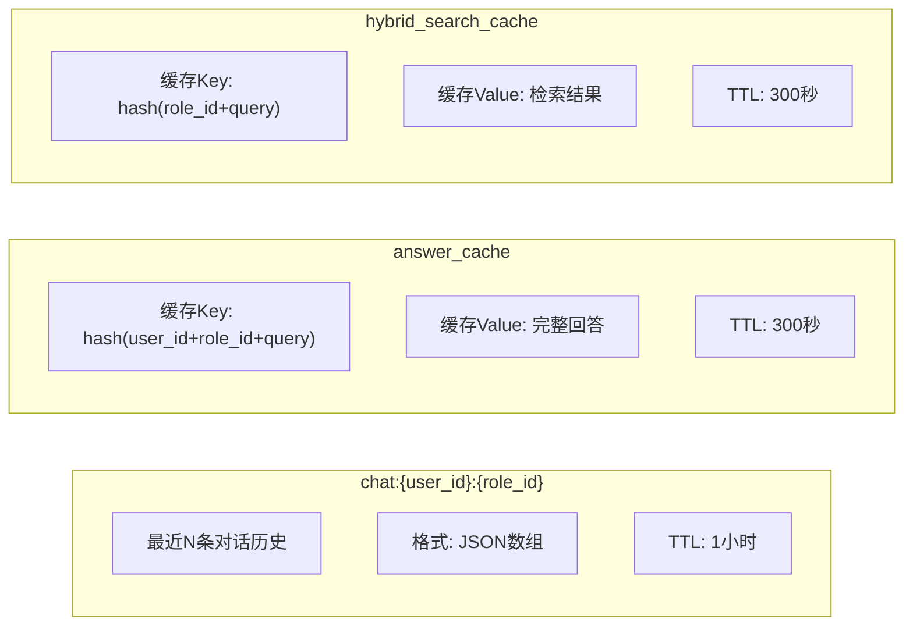

---

## 7. RAG核心能力

### 7.1 混合检索流程

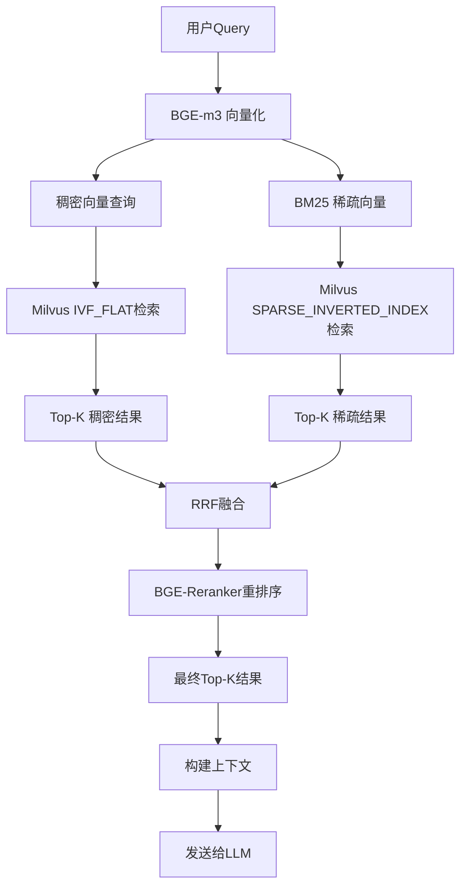

### 7.2 Query改写机制

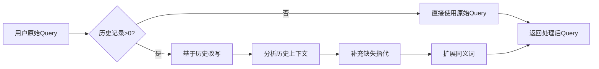

---

## 8. 角色系统

### 8.1 角色列表

| ID | 角色名 | 显示名称 | 职责 |
|----|--------|----------|------|
| 1 | doctor | 医生 | 健康咨询 |
| 2 | financial_advisor | 金融理财师 | 理财建议 |
| 3 | investment_advisor | 投资顾问 | 投资分析 |
| 4 | financial_planner | 财务规划师 | 财务规划 |
| 5 | psychologist | 心理医生 | 心理咨询 |
| 6 | virtual_friend | 虚拟朋友 | 日常陪伴 |
| 7 | teacher | 教师 | 教育辅导 |
| 8 | lawyer | 律师 | 法律咨询 |
| 9 | scientist | 科学家 | 科学知识 |
| 10 | english_tutor | 英语助手 | 英语学习 |
| 11 | stock_analyst | 股票分析师 | 股票分析 |

### 8.2 角色提示词模板结构

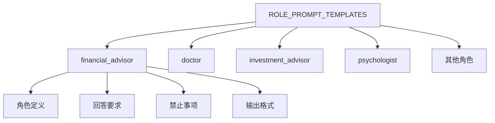

---

## 9. API接口详解

### 9.1 认证接口

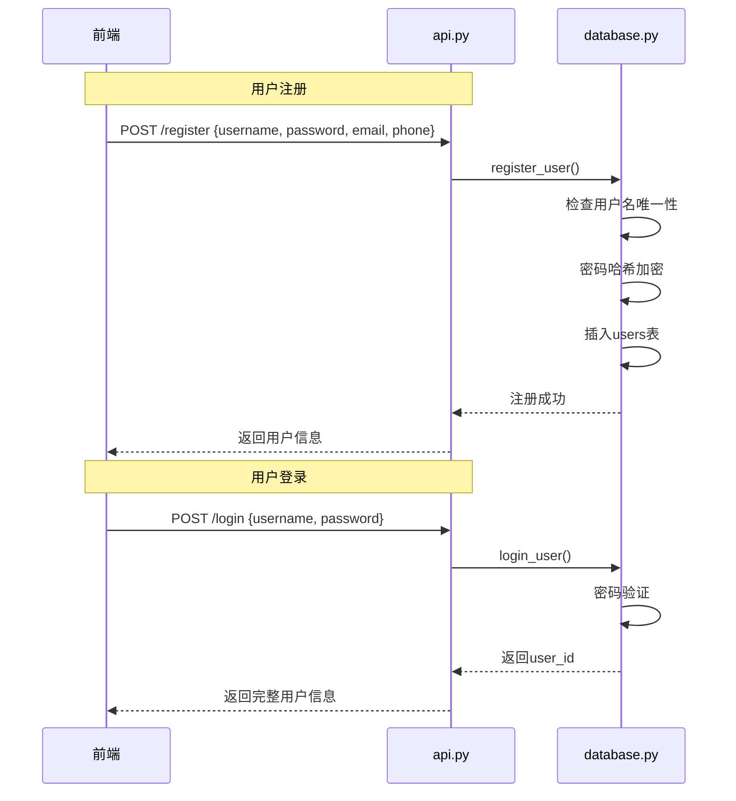

### 9.2 对话接口（核心）

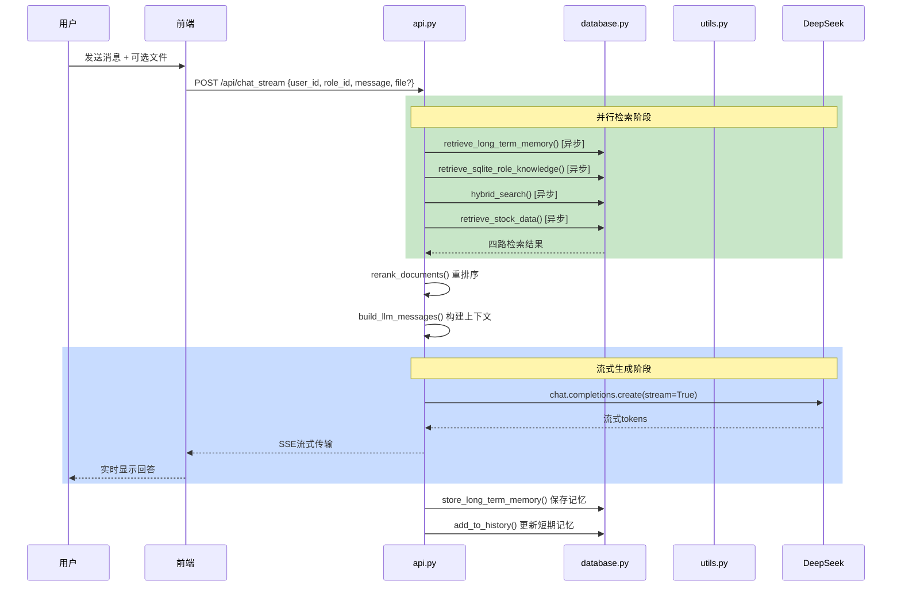

---

## 10. 错误处理与降级机制

### 10.1 服务降级策略

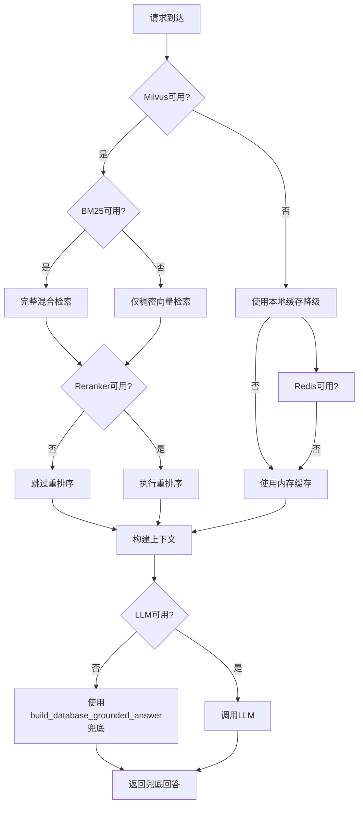

### 10.2 超时处理

| 操作 | 超时时间 | 降级策略 |
|------|----------|----------|
| 并行检索 | 45秒 | 超时任务返回空结果 |
| LLM调用 | 120秒 | 返回超时提示 |
| 文件解析 | 30秒 | 返回解析失败提示 |
| 数据库连接 | 30秒 | 抛出异常 |

---

## 11. 性能优化

### 11.1 缓存策略

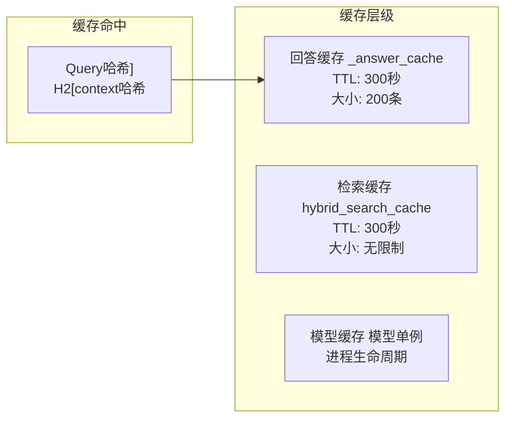

### 11.2 并行处理

| 操作 | 并行方式 | 线程数 |
|------|----------|--------|
| 四路检索 | ThreadPoolExecutor | 4 |
| 模型预热 | 启动时加载 | - |
| 向量化 | BGE-m3批处理 | - |

---

## 12. 部署架构

### 12.1 组件架构

```mermaid
graph TB
    subgraph 前端服务["前端服务"]
        F1["web_frontend_show.py<br/>端口: 8505"]
    end

    subgraph 后端服务["后端服务"]
        B1["main.py<br/>端口: 8000"]
    end

    subgraph 数据服务["数据服务"]
        M1["MySQL<br/>端口: 3306"]
        M2["Milvus<br/>端口: 19530"]
        R1["Redis<br/>端口: 6379"]
    end

    subgraph 外部服务["外部服务"]
        L1["DeepSeek API"]
        E1["东方财富API"]
    end

    F1 --> B1
    B1 --> M1
    B1 --> M2
    B1 --> R1
    B1 --> L1
    B1 --> E1
```

### 12.2 启动命令

```bash
# 1. 启动后端服务
cd last_duan
python main.py

# 2. 启动前端服务（新终端）
cd web_frontend
python web_frontend_show.py

# 3. 访问
# 前端: http://127.0.0.1:8505
# 后端API: http://127.0.0.1:8000
# API文档: http://127.0.0.1:8000/docs
```

---

## 13. 版本历史

| 版本 | 日期 | 变更说明 |
|------|------|---------|
| 1.0.0 | 2024-01 | 初始版本，实现基础RAG对话功能 |
| 1.1.0 | 2026-05 | 前端代码拆分、多模态支持、并行检索优化 |

---

## 14. 附录

### 14.1 环境变量配置

```bash
# 大模型配置
LLM_PROVIDER=deepseek
DEEPSEEK_API_KEY=your_api_key

# 模型路径
BGE_M3_PATH=D:\模型\bge_m3_model
BGE_RERANKER_PATH=D:\模型\bge-reranker-base

# MySQL配置
MYSQL_HOST=127.0.0.1
MYSQL_PORT=3306
MYSQL_USER=root
MYSQL_PASSWORD=your_password
MYSQL_DATABASE=roleplay

# Redis配置
REDIS_HOST=localhost
REDIS_PORT=6379

# Milvus配置
MILVUS_HOST=192.168.18.128
MILVUS_PORT=19530
```

### 14.2 依赖列表

```
fastapi>=0.104.0
uvicorn>=0.24.0
pymilvus>=2.6.0
pymysql>=1.1.0
redis>=5.0.0
openai>=1.0.0
sentence-transformers>=2.2.0
pytesseract>=0.3.10
Pillow>=10.0.0
easyocr>=1.7.0
python-docx>=1.0.0
PyPDF2>=3.0.0
```

---

**文档版本**: 1.0.0
**最后更新**: 2026-05-09
**基于代码版本**: last_duan/ (api.py, database.py, utils.py, main.py)
