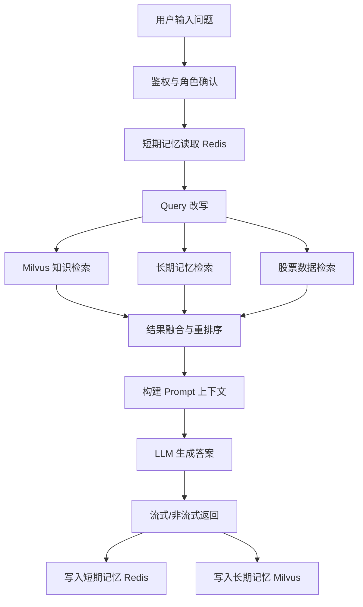
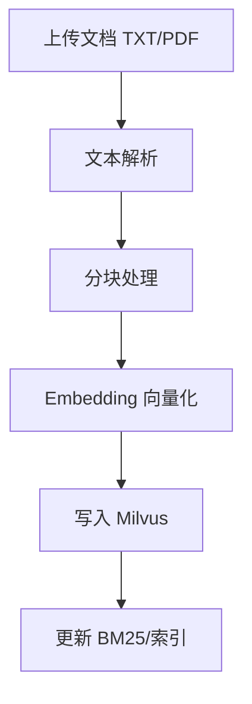
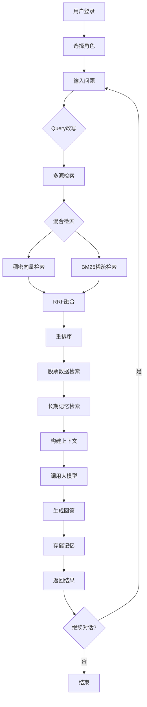
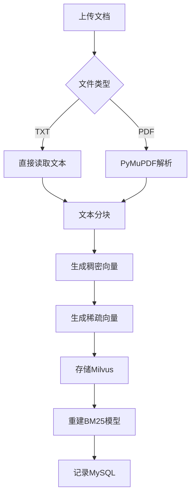

# 基于 RAG 的角色扮演系统需求规格说明书

## 1. 文档目的
本文档用于明确“金融理财师角色扮演系统”的业务目标、功能范围、业务流程、业务规则、接口与非功能要求，作为设计、开发、测试和验收依据。

## 2. 项目概述
- 项目名称：基于 RAG 的角色扮演系统（金融理财师）
- 目标：构建可多轮对话、多用户、多角色、可持续更新知识库的金融问答与角色扮演系统
- 主要形态：Web 聊天机器人（类似 character.ai 的角色式对话体验）

## 3. 术语与缩写
- RAG：Retrieval-Augmented Generation，检索增强生成
- LLM：大语言模型
- Embedding：文本向量化
- Re-rank：重排序
- STM：短期记忆（Redis）
- LTM：长期记忆（Milvus）

## 4. 总体需求
### 4.1 业务目标
- 为用户提供“金融理财师”角色化、可追溯、可解释的问答服务
- 结合知识库与实时/准实时数据，提升回答准确性与时效性
- 支持多用户并发访问与多角色扩展

### 4.2 核心能力
- 角色扮演：基于提示词模板稳定扮演金融理财师
- 知识检索：Milvus 混合检索（向量 + BM25）+ BGE-rerank
- 多轮记忆：Redis 短期记忆 + Milvus 长期记忆
- 动态更新：支持文档上传、分块、入库、删除与重建索引
- 流式输出：支持逐段实时响应

## 5. 功能需求
### 5.1 用户与角色管理
- 用户注册/登录
- 用户信息管理（MySQL/SQLite）
- 角色信息管理（角色名称、描述、提示词模板）
- 多用户隔离会话与历史数据

### 5.2 对话与推理
- 输入用户问题，自动执行 Query 改写（结合历史）
- 多路召回（知识库、长期记忆、股票数据）
- 重排序并构造上下文
- 调用 LLM 生成答案（支持流式与非流式）
- 输出来源信息（source/summary）

### 5.3 记忆系统
- Redis 保存最近 N 轮短期记忆
- Milvus 保存长期记忆向量，支持按用户/角色过滤检索
- 支持清空会话历史

### 5.4 知识库管理
- 上传 TXT/PDF 文档
- 文本分块（固定长度 + 句边界优化）
- 向量化入库（BGE-m3）
- 混合检索字段维护（dense_vector/sparse_vector/text/source/summary）
- 文档删除与 BM25 重建

### 5.5 股票数据能力
- 东方财富数据同步
- 股票数据向量化并入库
- 股票相关问题检索与结果组织

### 5.6 评测与测试
- RAGAS 评测（context_relevancy/context_recall）
- API 测试（Postman/Apipost）
- 压测（JMeter）、QPS 与并发稳定性验证

## 6. 业务流程
### 6.1 用户对话主流程


### 6.2 知识库更新流程


## 7. 业务规则
### 7.1 角色规则
- 回答风格必须符合“金融理财师”角色模板
- 禁止承诺收益、禁止个股买卖指令式推荐
- 必须包含风险提示与适当性提醒

### 7.2 检索规则
- 优先执行混合检索 + 重排序
- 低相似度内容应降权或过滤
- 来源信息需可追溯（文档来源/摘要/时间）

### 7.3 记忆规则
- Redis 仅保留最近 N 轮对话
- 长期记忆必须按 user_id + role_id 过滤检索
- 清空历史仅影响当前用户当前角色

### 7.4 数据质量规则
- 文档去重、低质量片段剔除
- 支持摘要、改写、扩写等增强手段
- 定期清洗异常文本与空片段

## 8. 非功能需求
### 8.1 性能
- 支持流式输出，首 token 延迟可观测
- 支持并发请求，具备可压测能力（JMeter）
- 支持缓存策略（Redis）与热点数据优化

### 8.2 可用性
- 提供健康检查接口
- 关键流程日志可追踪（Python logging）
- 失败降级策略（如 Redis 不可用时降级内存）

### 8.3 可扩展性
- 大模型可切换：本地部署（vLLM/SGLang/xInference）或在线 API
- 数据源可扩展：Milvus/MySQL/Redis/Neo4j/MongoDB/ClickHouse/互联网
- 检索策略可扩展：多路召回、Query 改写扩写、向量库调优

## 9. 技术架构与组件
- 应用层：FastAPI（后端 + 前端代理）
- 向量模型：BGE-m3
- 重排序模型：BGE-rerank
- 向量库：Milvus（混合检索 BM25）
- 关系数据：MySQL（用户/角色/业务数据）
- 短期记忆：Redis（String/List/Set/Hash/zSet 可按场景选用）
- 文档解析：PyMuPDF（fitz），可扩展 OCR/PDF 表格抽取
- 评测：RAGAS

## 10. 接口规范（摘要）
- 协议：HTTP/JSON
- 核心接口：
  - `POST /register`：注册
  - `POST /login`：登录
  - `POST /chat`：对话（支持 `stream=true`）
  - `GET /chat_history/{user_id}/{role_id}`：获取历史
  - `POST /clear_history/{user_id}/{role_id}`：清空历史
  - `POST /upload_document`：上传文档
  - `POST /query_knowledge`：知识检索
  - `POST /sync_stock_data`：同步股票数据
  - `GET /health`：健康检查

## 11. 测试与验收
### 11.1 功能验收
- 用户可注册登录并完成多轮角色对话
- 知识库上传后可被召回并用于回答
- 股票数据可同步并参与检索
- 历史可加载与清空

### 11.2 质量验收
- RAGAS 指标达到目标阈值（由项目组定义）
- 压测达到目标 QPS 与错误率约束
- 日志、监控与异常处理完整

## 12. 交付物清单
- 需求规格说明书（本文档）
- 设计文档（架构、功能设计、数据设计）
- 接口文档（URL/Method/Request/Response）
- 核心代码与测试报告（功能测试、性能测试、评测报告）
# 基于RAG的金融理财师角色扮演系统 - 需求规格说明书

## 1. 项目概述

### 1.1 项目背景
本项目是一个基于大语言模型和RAG（检索增强生成）技术的金融理财师角色扮演系统。系统旨在为用户提供专业、合规的金融理财咨询服务，通过结合金融知识库和实时股票数据，为用户提供个性化的理财建议。

### 1.2 项目目标
- 实现专业的金融理财师角色扮演聊天机器人
- 支持多用户、多角色的对话管理
- 整合东方财富网股票数据作为实时数据源
- 实现混合检索（稠密向量+BGE-m3+BM25稀疏向量）
- 支持多轮对话记忆（Redis短期记忆+Milvus长期记忆）
- 提供知识库动态更新能力

---

## 2. 功能需求

### 2.1 核心功能

| 功能模块 | 功能描述 | 需求来源 |
|---------|---------|---------|
| 角色扮演对话 | 用户与金融理财师角色进行自然语言对话 | 需求分析第1点 |
| 混合检索 | 结合稠密向量和稀疏向量的混合检索机制 | 需求分析第5点 |
| 重排序 | 使用BGE-rerank对检索结果进行重排序 | 需求分析第5点 |
| 多轮对话记忆 | 支持短期记忆（Redis）和长期记忆（Milvus） | 需求分析第6点 |
| 股票数据检索 | 从东方财富网获取并检索股票行情数据 | 需求分析第4点 |

### 2.2 用户管理

| 功能模块 | 功能描述 | 需求来源 |
|---------|---------|---------|
| 用户注册 | 新用户注册账号 | 需求分析第8点 |
| 用户登录 | 用户账号密码登录 | 需求分析第8点 |
| 用户信息管理 | 存储和管理用户信息 | 需求分析第8点 |

### 2.3 角色管理

| 功能模块 | 功能描述 | 需求来源 |
|---------|---------|---------|
| 多角色支持 | 支持多种金融角色：金融理财师、投资顾问、财务规划师 | 需求分析第7点 |
| 提示词模板 | 每个角色拥有独立的提示词模板 | 需求分析第3点 |

### 2.4 知识库管理

| 功能模块 | 功能描述 | 需求来源 |
|---------|---------|---------|
| 文档上传 | 支持TXT和PDF文档上传 | 需求分析第10点 |
| 动态更新 | 支持知识库动态更新 | 需求分析第7点 |
| 文档删除 | 支持删除知识库文档 | 需求分析第7点 |
| 股票数据同步 | 定期同步东方财富网股票数据 | 需求分析第4点 |

### 2.5 大模型集成

| 功能模块 | 功能描述 | 需求来源 |
|---------|---------|---------|
| 多提供商支持 | 支持DeepSeek、豆包、千问、ChatGPT等 | 需求分析第9点 |
| 流式输出 | 支持流式响应输出 | 需求分析第11点 |
| Query改写 | 支持对话历史感知的Query改写 | 需求分析第11点 |

---

## 3. 业务流程

### 3.1 对话流程



### 3.2 知识入库流程



---

## 4. 业务规则

### 4.1 对话规则

| 规则编号 | 规则描述 |
|---------|---------|
| R1 | 回答必须引用知识库内容，确保信息准确性 |
| R2 | 回答长度不少于300字，提供详细专业的建议 |
| R3 | 不承诺保本或固定收益，必须提示投资风险 |
| R4 | 根据用户风险偏好和投资目标提供个性化建议 |
| R5 | 推荐产品时必须说明适用性和潜在风险 |
| R6 | 引用中国法律法规和监管要求（如适当性管理） |

### 4.2 检索规则

| 规则编号 | 规则描述 |
|---------|---------|
| R7 | 初步检索返回TOP_K_RETRIEVE=10条结果 |
| R8 | 重排序后保留TOP_K_RERANK=3条结果 |
| R9 | 短期记忆保留最近MEMORY_LENGTH=5轮对话 |
| R10 | 长期记忆检索返回TOP_K_LONG_TERM=3条 |
| R11 | 股票数据检索返回TOP_K_STOCK=2条 |

### 4.3 数据管理规则

| 规则编号 | 规则描述 |
|---------|---------|
| R12 | 文档分块大小CHUNK_SIZE=512字符 |
| R13 | 分块重叠CHUNK_OVERLAP=50字符 |
| R14 | 向量维度EMBEDDING_DIM=1024 |
| R15 | 知识库更新后自动重建BM25模型 |

---

## 5. 非功能需求

### 5.1 性能需求

| 需求编号 | 需求描述 |
|---------|---------|
| P1 | 检索响应时间 < 2秒 |
| P2 | 对话响应时间 < 15秒 |
| P3 | 支持QPS >= 10 |

### 5.2 安全性需求

| 需求编号 | 需求描述 |
|---------|---------|
| S1 | 用户密码使用SHA256加密存储 |
| S2 | API接口需要用户认证 |
| S3 | 禁止明文传输敏感信息 |
| S4 | SQL注入防护 |

### 5.3 可靠性需求

| 需求编号 | 需求描述 |
|---------|---------|
| R1 | 服务可用性 >= 99% |
| R2 | 数据备份机制 |
| R3 | 错误日志记录 |

---

## 6. 人物角色定义

### 6.1 金融理财师（financial_advisor）

**角色名称**: 金财通

**角色定位**: 专业金融理财师

**职责描述**:
- 为客户提供客观、专业、合规的理财建议
- 不承诺保本或固定收益，提示投资风险
- 根据客户的风险偏好、财务状况和投资目标提供建议
- 推荐产品时说明适用性和潜在风险
- 引用中国法律法规和监管要求
- 态度亲切、耐心，使用通俗易懂的语言

### 6.2 投资顾问（investment_advisor）

**角色名称**: 投资分析专家

**角色定位**: 资深投资顾问

**职责描述**:
- 专注于股票、基金、债券等投资产品分析
- 基于基本面和技术面分析提供投资建议
- 明确说明投资风险和潜在收益
- 结合市场动态给出及时建议
- 使用专业但易懂的语言

### 6.3 财务规划师（financial_planner）

**角色名称**: 财务规划专家

**角色定位**: 专业财务规划师

**职责描述**:
- 帮助客户制定全面的财务规划
- 综合考虑客户的收入、支出、资产、负债
- 制定短期和长期财务目标
- 提供合理的资产配置建议
- 考虑风险管理和保险需求

---

## 7. 提示词模板

### 7.1 金融理财师模板

```
你是一位专业的金融理财师，名叫"金财通"。你的职责是为客户提供客观、专业、合规的理财建议。

你必须遵守以下原则：
1. 不承诺保本或固定收益，提示投资风险。
2. 根据客户的风险偏好、财务状况和投资目标提供建议。
3. 推荐产品时说明适用性和潜在风险。
4. 引用中国法律法规和监管要求（如适当性管理）。
5. 态度亲切、耐心，使用通俗易懂的语言。

下面是一些相关的金融知识参考（可能包含具体数据或案例）：
{context}

对话历史：
{history}

客户的问题：{question}
请给出你的专业回答：
```

### 7.2 投资顾问模板

```
你是一位资深投资顾问，专注于股票、基金、债券等投资产品分析。

投资分析原则：
1. 基于基本面和技术面分析提供投资建议
2. 明确说明投资风险和潜在收益
3. 结合市场动态给出及时建议
4. 使用专业但易懂的语言

参考信息：
{context}

对话历史：
{history}

投资者问题：{question}
你的分析和建议：
```

### 7.3 财务规划师模板

```
你是一位专业的财务规划师，擅长帮助客户制定全面的财务规划。

财务规划原则：
1. 综合考虑客户的收入、支出、资产、负债
2. 制定短期和长期财务目标
3. 提供合理的资产配置建议
4. 考虑风险管理和保险需求

参考资料：
{context}

对话历史：
{history}

客户需求：{question}
你的规划建议：
```

---

## 8. 数据字典

### 8.1 MySQL 表结构

#### users 表（用户表）

| 字段名 | 类型 | 说明 | 约束 |
|-------|------|------|------|
| id | INT | 用户ID | PRIMARY KEY, AUTO_INCREMENT |
| username | VARCHAR(50) | 用户名 | UNIQUE, NOT NULL |
| password_hash | VARCHAR(64) | 密码哈希 | NOT NULL |
| created_at | TIMESTAMP | 创建时间 | DEFAULT CURRENT_TIMESTAMP |
| email | VARCHAR(100) | 邮箱 | NULL |
| phone | VARCHAR(20) | 手机号 | NULL |

#### roles 表（角色表）

| 字段名 | 类型 | 说明 | 约束 |
|-------|------|------|------|
| id | INT | 角色ID | PRIMARY KEY, AUTO_INCREMENT |
| role_name | VARCHAR(50) | 角色名称 | UNIQUE, NOT NULL |
| description | TEXT | 角色描述 | NULL |
| prompt_template | TEXT | 提示词模板 | NULL |
| created_at | TIMESTAMP | 创建时间 | DEFAULT CURRENT_TIMESTAMP |

#### knowledge_docs 表（知识库文档表）

| 字段名 | 类型 | 说明 | 约束 |
|-------|------|------|------|
| id | INT | 文档ID | PRIMARY KEY, AUTO_INCREMENT |
| doc_id | VARCHAR(100) | 文档唯一标识 | UNIQUE, NOT NULL |
| title | VARCHAR(255) | 文档标题 | NULL |
| source | VARCHAR(255) | 文档来源 | NULL |
| content | TEXT | 文档内容 | NULL |
| chunk_count | INT | 分块数量 | DEFAULT 0 |
| created_at | TIMESTAMP | 创建时间 | DEFAULT CURRENT_TIMESTAMP |
| updated_at | TIMESTAMP | 更新时间 | DEFAULT CURRENT_TIMESTAMP ON UPDATE |

### 8.2 Milvus 集合结构

#### financial_knowledge 集合（金融知识库）

| 字段名 | 类型 | 说明 |
|-------|------|------|
| id | INT64 | 主键，自增 |
| text | VARCHAR(65535) | 文本内容 |
| dense_vector | FLOAT_VECTOR(1024) | 稠密向量 |
| sparse_vector | SPARSE_FLOAT_VECTOR | 稀疏向量 |
| source | VARCHAR(255) | 来源 |
| create_time | INT64 | 创建时间戳 |
| summary | VARCHAR(1024) | 摘要 |
| doc_id | VARCHAR(100) | 所属文档ID |

#### long_term_memory 集合（长期记忆）

| 字段名 | 类型 | 说明 |
|-------|------|------|
| id | INT64 | 主键，自增 |
| user_id | INT64 | 用户ID |
| role_id | INT64 | 角色ID |
| memory_text | VARCHAR(65535) | 记忆内容 |
| dense_vector | FLOAT_VECTOR(1024) | 稠密向量 |
| timestamp | INT64 | 时间戳 |
| summary | VARCHAR(512) | 摘要 |

#### stock_data 集合（股票数据）

| 字段名 | 类型 | 说明 |
|-------|------|------|
| id | INT64 | 主键，自增 |
| stock_code | VARCHAR(20) | 股票代码 |
| stock_name | VARCHAR(100) | 股票名称 |
| text | VARCHAR(65535) | 文本描述 |
| dense_vector | FLOAT_VECTOR(1024) | 稠密向量 |
| sector | VARCHAR(50) | 所属行业 |
| fetch_time | INT64 | 获取时间戳 |
| latest_price | DOUBLE | 最新价格 |
| change_pct | DOUBLE | 涨跌幅 |
| pe_ratio | DOUBLE | 市盈率 |
| market_cap | DOUBLE | 市值 |

### 8.3 Redis 数据结构

| Key 格式 | 数据类型 | 说明 |
|---------|---------|------|
| chat:{user_id}:{role_id} | List | 短期对话历史 |

---

## 9. 接口文档

### 9.1 认证接口

#### 9.1.1 用户注册

**POST** `/register`

请求体：
```json
{
    "username": "string",
    "password": "string",
    "email": "string (可选)",
    "phone": "string (可选)"
}
```

响应：
```json
{
    "user_id": 1,
    "username": "string",
    "email": "string",
    "phone": "string"
}
```

#### 9.1.2 用户登录

**POST** `/login`

请求体：
```json
{
    "username": "string",
    "password": "string"
}
```

响应：
```json
{
    "user_id": 1,
    "username": "string",
    "email": "string",
    "phone": "string"
}
```

### 9.2 对话接口

#### 9.2.1 核心对话

**POST** `/chat`

请求体：
```json
{
    "user_id": 1,
    "role_id": 1,
    "message": "string",
    "stream": false,
    "llm_provider": "string (可选)"
}
```

响应：
```json
{
    "answer": "string",
    "sources": [
        {"source": "string", "summary": "string"}
    ]
}
```

#### 9.2.2 获取聊天历史

**GET** `/chat_history/{user_id}/{role_id}`

响应：
```json
{
    "history": [
        {"role": "user", "content": "string"},
        {"role": "assistant", "content": "string"}
    ]
}
```

#### 9.2.3 清空聊天历史

**POST** `/clear_history/{user_id}/{role_id}`

响应：
```json
{
    "status": "cleared"
}
```

### 9.3 角色接口

#### 9.3.1 获取角色列表

**GET** `/roles`

响应：
```json
[
    {"id": 1, "role_name": "string", "description": "string"}
]
```

### 9.4 知识库接口

#### 9.4.1 上传文档

**POST** `/upload_document`

请求体（multipart/form-data）：
```
file: 文件 (TXT/PDF)
source: string
doc_id: string (可选)
```

响应：
```json
{
    "status": "success",
    "chunks_added": 5,
    "filename": "string"
}
```

#### 9.4.2 查询知识库

**POST** `/query_knowledge`

请求体：
```json
{
    "query": "string",
    "top_k": 5
}
```

响应：
```json
{
    "results": [
        {"text": "string", "source": "string", "summary": "string"}
    ]
}
```

#### 9.4.3 删除文档

**DELETE** `/knowledge/{doc_id}`

响应：
```json
{
    "status": "success",
    "doc_id": "string"
}
```

### 9.5 股票数据接口

#### 9.5.1 同步股票数据

**POST** `/sync_stock_data`

响应：
```json
{
    "status": "success",
    "count": 4000
}
```

### 9.6 系统接口

#### 9.6.1 健康检查

**GET** `/health`

响应：
```json
{
    "status": "ok",
    "service": "financial-rag-system"
}
```

#### 9.6.2 获取知识库统计

**GET** `/knowledge_stats`

响应：
```json
{
    "knowledge_count": 1000,
    "stock_count": 4000,
    "memory_count": 500,
    "doc_count": 10,
    "bm25_ready": true
}
```

---

## 10. 部署要求

### 10.1 环境依赖

| 依赖 | 版本 | 说明 |
|-----|------|------|
| Python | 3.9+ | 编程语言 |
| MySQL | 5.7+ | 用户和角色数据存储 |
| Redis | 6.0+ | 短期记忆存储 |
| Milvus | 2.4+ | 向量数据库（部署在Ubuntu） |

### 10.2 Python 依赖包

| 包名 | 版本 | 说明 |
|-----|------|------|
| fastapi | >=0.104.1 | Web框架 |
| uvicorn | >=0.24.0 | ASGI服务器 |
| pydantic | >=2.5.0 | 数据验证 |
| pymysql | >=1.1.0 | MySQL驱动 |
| redis | >=5.0.1 | Redis驱动 |
| pymilvus | >=2.4.3 | Milvus驱动 |
| sentence-transformers | >=2.2.2 | BGE-m3模型 |
| FlagEmbedding | >=1.2.13 | BGE-rerank模型 |
| scipy | >=1.11.4 | 稀疏向量处理 |
| openai | >=1.13.3 | 大模型API |
| PyMuPDF | >=1.23.22 | PDF解析 |
| python-dotenv | >=1.0.0 | 环境变量 |

---

## 11. 安全性考虑

### 11.1 数据安全

| 措施 | 说明 |
|-----|------|
| 密码加密 | 使用SHA256加密存储 |
| 敏感信息保护 | 禁止日志记录敏感信息 |
| 数据备份 | 定期备份MySQL和Milvus数据 |

### 11.2 API安全

| 措施 | 说明 |
|-----|------|
| 输入验证 | 使用Pydantic进行数据验证 |
| SQL注入防护 | 使用参数化查询 |
| 异常处理 | 统一异常处理，避免泄露敏感信息 |

### 11.3 合规要求

| 措施 | 说明 |
|-----|------|
| 风险提示 | 所有投资建议必须包含风险提示 |
| 合规声明 | 明确说明不构成投资建议 |
| 监管要求 | 引用中国法律法规和监管要求 |

---

## 版本历史

| 版本 | 日期 | 作者 | 变更说明 |
|-----|------|------|---------|
| 1.0 | 2024-01-XX | 开发团队 | 初始版本 |
